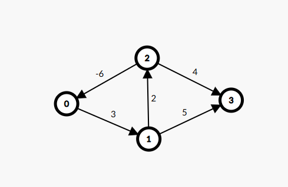

# Floyd-Warshall Algorithm with Negative Cycle Detection

## Overview
The **Floyd-Warshall algorithm** is an all-pairs shortest path algorithm used to find the shortest distances between every pair of vertices in a weighted graph. It works efficiently for both directed and undirected graphs and can detect **negative weight cycles**.


## Algorithm Explanation
The Floyd-Warshall algorithm follows a **dynamic programming** approach and updates the shortest paths by considering each vertex as an intermediate node. It updates the distance matrix iteratively using the following recurrence relation:

\[ \text{dist}[i][j] = \min(\text{dist}[i][j], \text{dist}[i][k] + \text{dist}[k][j]) \]

Where:
- `dist[i][j]` represents the shortest distance from vertex `i` to vertex `j`.
- `k` represents the intermediate vertex used to update the shortest path.

## Detecting Negative Weight Cycles
A **negative weight cycle** exists if, after running Floyd-Warshall, `dist[i][i] < 0` for any vertex `i`. This means that a cycle exists with an overall negative sum of weights, allowing infinite reductions in path cost.

## Implementation in C++
```cpp
#include <bits/stdc++.h>
using namespace std;

#define INF 1e9

void floydWarshall(vector<vector<int>> &dist, int n) {
    for (int k = 0; k < n; k++) {
        for (int i = 0; i < n; i++) {
            for (int j = 0; j < n; j++) {
                if (dist[i][k] != INF && dist[k][j] != INF) {
                    dist[i][j] = min(dist[i][j], dist[i][k] + dist[k][j]);
                }
            }
        }
    }
    
    // Check for negative weight cycles
    for (int i = 0; i < n; i++) {
        if (dist[i][i] < 0) {
            cout << "Negative Weight Cycle Detected\n";
            return;
        }
    }
    
    cout << "Shortest Distance Matrix:\n";
    for (int i = 0; i < n; i++) {
        for (int j = 0; j < n; j++) {
            if (dist[i][j] == INF) cout << "INF ";
            else cout << dist[i][j] << " ";
        }
        cout << "\n";
    }
}

int main() {
    int n, e;
    cin >> n >> e;
    vector<vector<int>> dist(n, vector<int>(n, INF));
    
    for (int i = 0; i < n; i++) dist[i][i] = 0;
    
    for (int i = 0; i < e; i++) {
        int u, v, w;
        cin >> u >> v >> w;
        dist[u][v] = w;
    }
    
    floydWarshall(dist, n);
    return 0;
}
```

## Complexity Analysis
- **Time Complexity:** \(O(V^3)\), as there are three nested loops.
- **Space Complexity:** \(O(V^2)\), since a 2D distance matrix is used.

## Applications
- **Shortest path calculation** for all pairs of nodes.
- **Network routing** to find optimal paths between nodes.
- **Finding negative cycles** in financial models, transportation, and graph-based problems.

## Example Graph

A sample graph used for demonstration:

- Vertices: `{0, 1, 2, 3}`
- Weighted edges: `{(0→1,3), (1→2,-2), (2→3,5), (3→1,1)}`
- The graph contains a **negative weight cycle** if an edge is added that forms a cycle with a net negative sum.



## How to Run
1. Compile the C++ file:
   ```sh
   g++ floyd_warshall.cpp -o floyd_warshall
   ```
2. Run the program:
   ```sh
   ./floyd_warshall
   ```


# Algorithm Complexity Comparison

This document compares the **time** and **space** complexities of the following graph algorithms:
- **Breadth-First Search (BFS)**
- **Depth-First Search (DFS)**
- **Dijkstra’s Algorithm**
- **Bellman-Ford Algorithm**
- **Floyd-Warshall Algorithm**

## Time Complexity Comparison
| Algorithm         | Best Case       | Average Case     | Worst Case       |
|------------------|----------------|------------------|------------------|
| **BFS**         | O(V + E)        | O(V + E)         | O(V + E)         |
| **DFS**         | O(V + E)        | O(V + E)         | O(V + E)         |
| **Dijkstra** (Using Min-Heap) | O((V + E) log V) | O((V + E) log V) | O((V + E) log V) |
| **Bellman-Ford** | O(VE)          | O(VE)            | O(VE)            |
| **Floyd-Warshall** | O(V³)        | O(V³)            | O(V³)            |

## Space Complexity Comparison
| Algorithm         | Space Complexity |
|------------------|-----------------|
| **BFS**         | O(V + E)         |
| **DFS**         | O(V + E)         |
| **Dijkstra**    | O(V + E)         |
| **Bellman-Ford** | O(V)            |
| **Floyd-Warshall** | O(V²)        |

## Summary
- **BFS and DFS** are the fastest for unweighted graphs.
- **Dijkstra** is efficient for shortest paths in graphs with non-negative weights.
- **Bellman-Ford** handles negative weights and detects negative cycles but is slower.
- **Floyd-Warshall** is ideal for all-pairs shortest paths but is inefficient for large graphs.

Choose the best algorithm based on your use case!